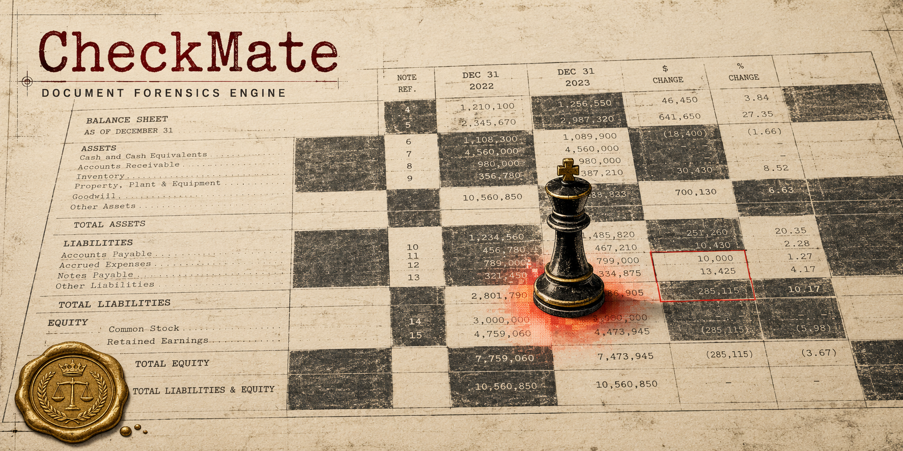
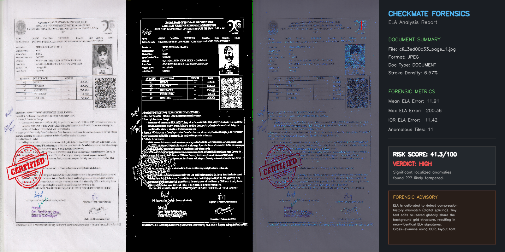
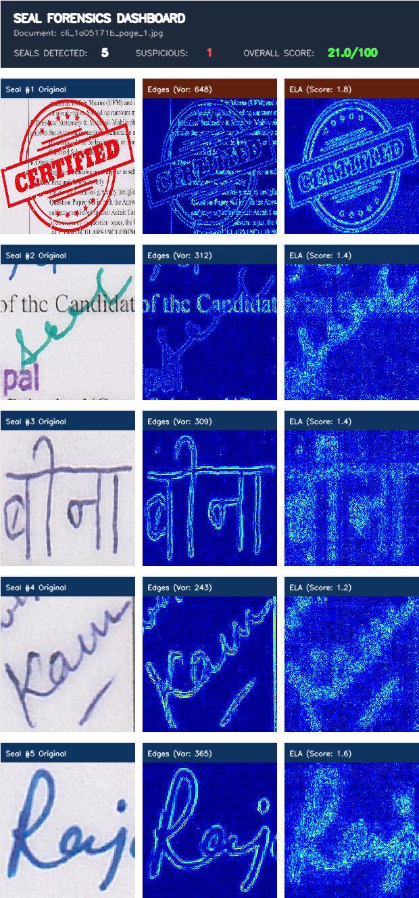

# CheckMate — AI Document Forensic Toolkit



> [!NOTE]
> **Local-First Priority**: CheckMate is engineered to prioritize local-first processing. All document forensics, OCR extraction, Error Level Analysis (ELA), and LLM-based investigation run fully offline on your local machine or dedicated secure VM. Your sensitive document data never leaves your environment.

## Problem

In the era of digital documents, detecting sophisticated forgeries—such as manipulated bank statements, spliced KYC documents, or cloned official seals—is incredibly difficult. Traditional underwriters and verifiers rely on manual review, which is slow, error-prone, and easily fooled by modern image editing tools. As financial and identity frauds grow in complexity, existing single-purpose tools (checking only OCR or metadata) fail to catch multi-layered tampering.

## Solution

CheckMate is a professional, multi-layered document verification and forensic analysis suite built entirely for the command line. It automates forensic analysis using parallel pipelines to detect structural, visual, and semantic forgeries in high-stakes documents. By combining statistical image analysis, object detection, and metadata rule engines, CheckMate fuses the results into a single, calibrated risk score, backed by an LLM that explains the anomalies in plain English.

## Why CheckMate is Different

- **Multi-modal forensics in one system**: Fuses 4 independent pipelines (Error Level Analysis, Metadata, Seal Detection, NLP Cross-Doc) into a single unified risk score.

- **LLM-as-investigator**: The LLM doesn't just classify—it receives the full forensic context and reasons about *why* a document is suspicious, allowing you to ask questions about the findings.

- **QR-to-OCR cross-verification**: Parses QR payloads and cross-references them against extracted OCR text to catch sophisticated mismatches.

- **Scanned vs. Digital dual-weight fusion**: Uses different scoring profiles depending on whether a document is scanned (ELA weighted higher) or digitally generated (metadata weighted higher).

- **India-specific regulatory knowledge**: Validates PAN, Aadhaar, and GSTIN formatting, and performs UGC university recognition checks.

- **Offline-first & CLI-native**: Designed for air-gapped, high-security environments. Operates entirely locally via a polished, conversational command-line interface.

## Demo

<video src="https://github.com/user-attachments/assets/eb07532d-cc06-4ad1-88eb-d5e00408483f" width="100%" controls></video>

## Screenshots

- **CLI Dashboard**:


- **ELA Dashboard**:


- **Seal and Stamp Detection**:


## Architecture

CheckMate operates via a 10-step asynchronous pipeline orchestrator:
`Upload → Ingestion → Parallel Analysis (ELA, Metadata, Seal, NLP) → LLM Classification → Registry Verification → Pattern Detection → Fusion Scoring → AI Investigation → Report`

**Key Forensic Pipelines:**

- [Document Ingestion](docs/pipelines/document_ingestion.md): Normalizes documents, renders pages, and extracts native and OCR text.

- [Error Level Analysis (ELA) Forgery](backend/pipelines/ela_forgery/README.md): Analyzes compression noise changes to isolate modified pixels.

- [Metadata Forensics](docs/pipelines/metadata_forensics.md): Runs PDF dictionaries against a state machine of date and editing tool rules.

- [Seal & Signature Detection](docs/pipelines/seal_detection.md): YOLO-driven stamp extraction and boundary sharpness checks.

- [NLP Cross-Doc Scrutiny](docs/pipelines/nlp_cross_doc.md): Validates formatting, balance-sheet math, and QR-to-OCR alignments.

- [Score Fusion](docs/pipelines/score_fusion.md): Combines all metrics into a unified threat tier (Green, Amber, Red).

## Installation

### Prerequisites

- **Python 3.10+**
- **Tesseract OCR Binary** (Required for fallback OCR processing)
- **Optional**: CUDA Toolkit (for GPU acceleration)

### Environment Setup

Clone the repository and set up a Python virtual environment:
```bash
# Navigate to project root
cd checkmate

# Create and activate virtual environment
python -m venv venv
source venv/bin/activate  # On Windows: .\venv\Scripts\Activate.ps1

# Install dependencies
pip install -r requirements.txt
```

### Configure Environment

Create a `.env` file by copying the example:
```bash
cp .env.example .env
```
Ensure you set your `LLM_PROVIDER` (e.g., `ollama` or `google`) and configure the API URLs accordingly.

## Usage

CheckMate is a CLI-first tool featuring a custom-tailored theme built on the **Rich** styling engine to create a modern visual look directly in your terminal.

### 1. Launch the Backend Server

Start the FastAPI backend server (which runs the pipeline orchestrator):
```bash
uvicorn backend.main:app --host 127.0.0.1 --port 8000
```
*(Leave this running in the background. The server listens on `http://localhost:8000`)*

### 2. CLI Setup

In a new terminal window, activate your virtual environment and configure the CLI:
```bash
python -m checkmate_cli setup
```

### 3. Direct Document Analysis

Directly scan a document to view its forensic table and AI summary:
```bash
python -m checkmate_cli analyze <path_to_pdf_or_image>
```

### 4. Interactive Shell (REPL)

Launch the interactive shell for conversational forensics:
```bash
python -m checkmate_cli
```
This boots up system diagnostics, checks API health, and opens a `CheckMate >> ` session.

**Shell Slash Commands:**

- `/analyze <path>` (or `/a`): Load and scan a document.

- `/view <ela | metadata | seal | nlp>` (or `/v`): Dump raw JSON forensic maps for specific pipelines.

- `/report <output.html>` (or `/r`): Export the compiled PDF/HTML report.

- `/status` (or `/s`): Refresh backend server connection.

- `/reset` (or `/rt`): Clear chat memory and reset conversation history.

- `/exit` (or `/q`): Exit the session.

**Natural Language Routing (AI Assistant):**

Any input typed in the shell that does *not* begin with `/` is routed to the LLM assistant as a question. The assistant receives the full forensic context of the loaded document, allowing you to ask questions like:
```text
CheckMate [invoice.pdf] >> why is the risk score moderate?
```

### Remote Deployment

For deploying the backend core to a remote virtual machine (such as Oracle Cloud Infrastructure) with an offline LLM, see the [OCI VM Deployment Guide](docs/deployment/vm_deployment.md).
